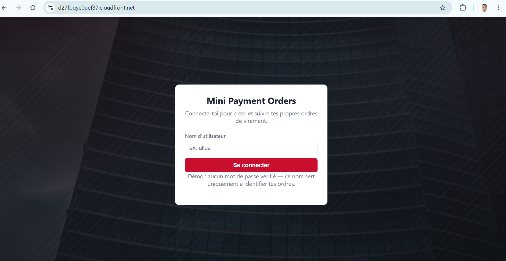
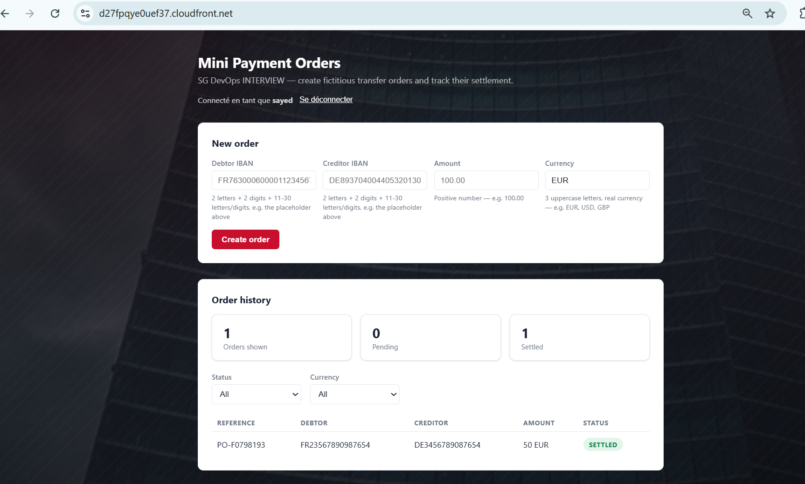
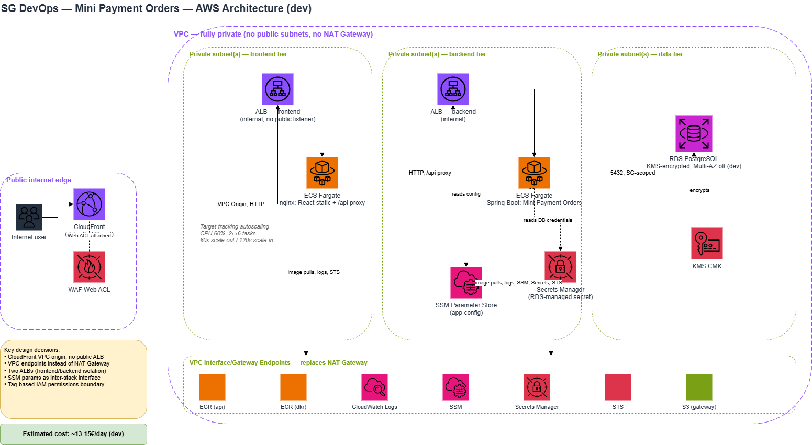

# Mini Payment Orders — SG DevOps Showcase

A containerized "mini payment orders" application (fictional bank transfer
orders), built to demonstrate a production-style deployment on AWS: CI/CD via
GitHub Actions, infrastructure as code with Terraform, and an architecture
designed around reliability, observability, secure secrets handling, and
horizontal scalability.

**Live URL:** https://d27fpqye0uef37.cloudfront.net/

## How it works

A visitor picks a display name to identify their own orders — no password,
this is a demo, not a real auth system:



Once "connected", they can create a payment order (debtor/creditor IBAN,
amount, currency) and watch the order history table refresh live. A
background scheduler settles each order (`PENDING` → `SETTLED`) a few seconds
after creation, so the table visibly changes on its own:



## Architecture



- **No public subnets anywhere.** The VPC has no NAT Gateway; outbound AWS API
  access goes through VPC endpoints only (ECR, S3, CloudWatch Logs, SSM,
  Secrets Manager, STS). CloudFront is the single public entry point, reaching
  the frontend ALB through a **VPC origin** — a private, CloudFront-managed
  connection into the VPC, not a public listener.
- **Security group chaining, never CIDR ranges**: the RDS security group only
  accepts 5432 from the backend service's own security group; the backend
  service only accepts traffic from the backend ALB; the backend ALB only
  accepts traffic from the frontend service; the frontend ALB only accepts
  traffic from CloudFront's managed IP range. Every hop is authorized by
  security-group reference, not by network range.
- **Two ECS Fargate services**, each running 2 tasks across 2 Availability
  Zones by default, scaling out to 6 tasks on sustained CPU load (target
  tracking, 60% CPU target).

### Secrets and configuration

- The **one real secret** — the RDS master password — is generated and
  rotated entirely by RDS itself into AWS Secrets Manager (encrypted with a
  customer-managed KMS key). Terraform never sees or stores the plaintext
  password; it's injected into the backend task as an environment variable by
  ECS itself (the `secrets` block of the task definition), before the
  container ever starts.
- Non-sensitive configuration (a demo info message, the config bucket name)
  lives in SSM Parameter Store, read directly by the backend at runtime
  through the AWS SDK — deliberately demonstrating direct SDK usage backed by
  the ECS task role and a VPC interface endpoint, as a second, distinct
  config-sourcing pattern from the Secrets Manager one above.
- CI/CD uses OIDC federation to assume AWS roles — zero long-lived AWS
  credentials stored in GitHub.
- Locally, DB credentials come from a gitignored `.env` file (see
  `.env.example`) rather than literal values in `docker-compose.yml`.

## The application

**Backend** (`apps/backend`) — Spring Boot 3 / Java 21. A minimal "payment
order" API: create and list fictional bank transfer orders (debtor/creditor
IBAN, amount, currency), with basic validation and a background scheduler
that settles orders (`PENDING` → `SETTLED`) after a few seconds, so the demo
UI stays visibly alive. Structured JSON logs with a request correlation ID,
Spring Actuator health/metrics endpoints, and an `/api/info` endpoint that
reads a parameter from SSM to demonstrate task-role + VPC-endpoint access.

**Frontend** (`apps/frontend`) — a single-page React app (Vite) behind nginx:
a form to create an order, a live-refreshing table of existing orders with
status badges, and a footer showing the backend's `/api/info` response. nginx
also reverse-proxies `/api/*` to the backend and forwards a correlation ID
header end-to-end.

## Resources deployed (per Terraform stack)

| Stack | Deploys |
|---|---|
| `bootstrap` | GitHub OIDC provider, CI IAM roles (read-only plan role, scoped deploy role with a tag-enforcement permissions boundary), Terraform state backend (S3 + DynamoDB lock), account-wide service-linked roles |
| `10-network` | VPC, 2 private subnets (2 AZs), VPC endpoints (ECR api/dkr, S3 gateway, CloudWatch Logs, SSM, Secrets Manager, STS), VPC flow logs |
| `20-platform` | ECS cluster, RDS PostgreSQL (encrypted, managed master password), a customer-managed KMS key, 2 ECR repositories, an S3 config bucket, SSM parameters |
| `30-services` | 2 internal ALBs (frontend/backend), 2 ECS Fargate services (task definitions, security groups, target-tracking autoscaling), a CloudWatch dashboard, a latency alarm |
| `40-edge` | An internet gateway (attached but never routed — the VPC stays fully private), a CloudFront VPC origin, WAF with AWS managed rule groups, the CloudFront distribution itself (the app's public URL) |

## Running locally

```bash
cp .env.example .env   # fill in DB_USER / DB_PASSWORD for local use
docker compose up --build
```

- Frontend: http://localhost:8080
- Backend directly: http://localhost:8081/actuator/health
- The `/api/info` SSM lookup fails gracefully to a local placeholder value
  when AWS isn't reachable — no AWS credentials are required to run locally.

## CI/CD

Every push builds, tests, and Trivy-scans a multi-architecture (amd64 +
arm64) Docker image; only pushes to `main` authenticate to AWS (via OIDC) and
push the image to ECR, publishing the deployed tag as an SSM parameter that
Terraform reads back when deploying `30-services`. Infrastructure changes go
through a separate plan/apply pipeline: `infra-plan` runs automatically on
every branch/PR (read-only role), `infra-apply` is manual-only
(`workflow_dispatch`), one stack and one environment at a time.

## Observability

CloudWatch dashboard — request rate, p95 latency, 5xx count, task CPU,
running task count, RDS connections:


ECS service scaling out under load (target-tracking autoscaling, CPU-based):


